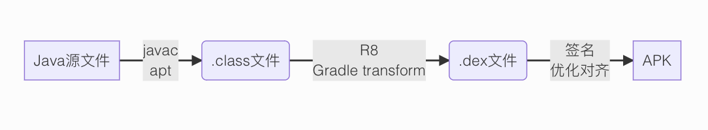
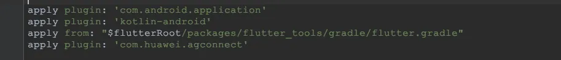
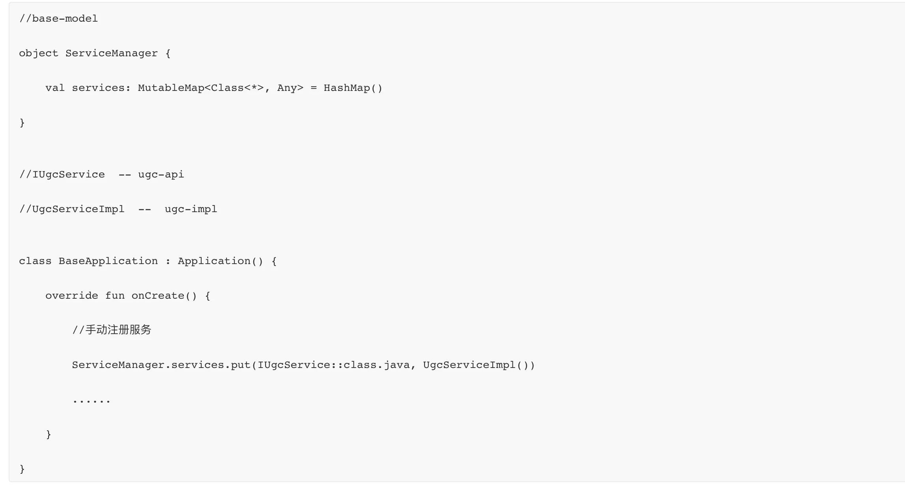
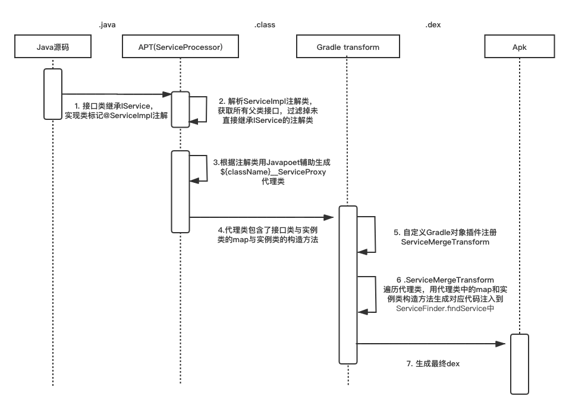
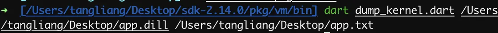
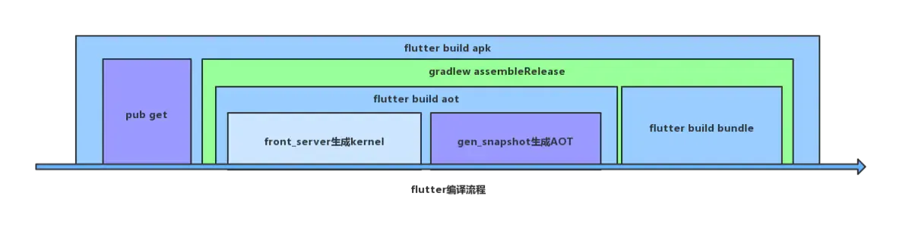
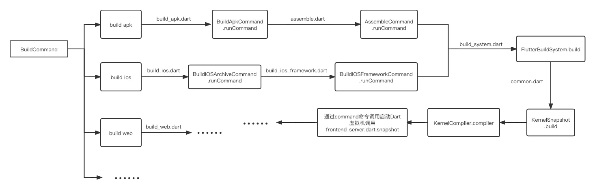

------------

## AOP：
### 什么是AOP
>Aspect Oriented Programming，面向切面编程，通过预编译方式和运行期间动态代理实现程序功能统一维护的一种技术。是对OOP（Object-Oriented Programing，面向对象编程）的补充和完善。OOP引入封装、继承和多态性等概念来建立一种对象层次结构，而当我们需要为分散的对象引入公共行为的时候，OOP则显得捉襟见肘。

### AOP能做什么
AOP是一个被严重忽视的技术点，它可以用**无侵入** 的 **横向拓展**
向现存的代码增加（weaving织入）**额外的行为**而不修改代码本身。业务开发中可以从一些系统级关注点(例如日志、性能)中脱离，与系统级/通用业务**解耦**，只需要关心业务逻辑本身。

理论上系统级的业务或框架都可以有AOP的介入：
- 无痕埋点
- 日志记录
- 覆盖率插桩
- 点击防抖
- 权限控制
- 性能统计(方法耗时)
- 热修复
- 组件化解耦、组件通信
- ......

包括业界常用的一些工具库也都有AOP的身影，例如安卓常用框架：DataBinding、Dagger2、ButterKnife、EventBus3等。

**小结：当用常规方式开发有难度或者不优雅时，不妨用AOP的编程方式想想**

## Android常用AOP方式与应用
**安卓大致编译打包流程：**



在整个编译打包流程中，官方提供apt和transform两个切入方式让开发者做AOP编程。其中apt阶段可以读取解析注解生成新类但不能修改现有类，transform阶段可以直接修改字节码能生成新类或者修改现有类。

### APT：
>APT(Annotation Processing Tool)：注解处理器是javac(java compiler)中处理Annotation注解的工具。是编译期间构建完AST（抽象语法树）之后进行的，通过APT我们可以对注解（自定义注解、系统注解）做相应的处理。例如读取注解的值，读取被注解标记的类的类型、泛型、父类，读取被注解标记的属性等。通常是用APT+Javapoet生成java代码类，生成的类也会参与javac的编译。

### Gradle Transform
**Gradle基础：**Gradle是专注于灵活性和性能的开源构建自动化工具。
Project和Task是Gradle最重要的两个概念：一个项目(Project)可以是用来构建Jar、aar、Apk，通常由一个或者多个Task组成。Task代表着构建执行中的一个原子操作，比如说编译class，生成apk等。Task之间可以通过dependsOn、mustRunAfter等方法添加依赖关系。</br>
所有的Gradle Task的执行都会经过三个阶段（例如./gradlew assembleDebug也走了这三个阶段）：
1. 初始化阶段：初始化项目环境，执行settings.gradle确定有哪些项目参与构建
2. 配置阶段：执行所有项目的build.gradle文件，创建&配置Task，梳理Task依赖形成一个有向无环图
3. 执行阶段：按照之前配置好的顺序执行Task

**Gradle Plugin：**
Gradle插件是一组可复用的构建逻辑，有脚本插件[apply from: xxx)]和对象插件[apply plugin : xxx]两种，主要用来获取项目构建中的各种信息，干预项目构建流程，增加自定义逻辑。Flutter的构建流程也是通过脚本插件flutter.gradle嵌入FlutterPlugin实现



**Transform：**

>Gradle Transform是Android官方提供给开发者在项目构建阶段由class到dex转换期间修改class文件的一套API。目前经典的应用就是字节码插桩和代码注入技术。有了这个API，我们就可以根据自己的业务需求做一些定制。

我们可以通过Gradle插件来注册我们编写的Transform。注册后的Transform会被Gradle包装成一个Gradle Task，这个TransForm Task会在javac Task执行完毕后运行。

**ASM介绍：**ASM是一个通用的Java字节码操作和分析框架。 它可以以二进制形式修改现有类或动态生成类。使用ASM修改字节码，需要对class字节码文件的格式以及JVM的执行模型有一定的了解，限于篇幅，这里不展开介绍。


### AOP实践-组件通信
各业务模块独立成组件之后，存在编译隔离，组件之间不能直接依赖。各业务间相互调用要怎么处理呢？</br>
安卓原生提供的方式类似广播、共享内存、intent等，开发与维护起来都非常麻烦</br>
业界通用的解决方法：EventBus的事件通知，组件服务化等。

**事件通知** 明显的缺陷是代码上下文难以关联，堆栈的切换导致断点/追踪代码比较困难
</br>**组件服务化** 是指把业务组件拆分为api+impl，api层作为与其他组件通信媒介接口，真正的实现在impl层，外界依赖api层实现组件的通信。

**组件服务化方案设计：**

方案一：全局工具类


业务模块只需要依赖ServiceManager(base-model)，传入api层对应的接口，就能获取实例了。但这种方案的缺点也很明显：

1. 实例不是懒加载，Service比较多的情况下会严重影响App启动速度
2. 模块代码对业务层(ugc-impl)存在依赖，无法解决编译隔离问题


方案二：反射

```
//base-model

object ServiceManager {
	  //注册
	val servicesMap: MutableMap<Class<*>, String> = HashMap()

 	//实例缓存
	private val servicesCache: MutableMap<Class<*>, Any> = HashMap()

	fun <T> getService(mClass: Class<T>): T? {
		if (!servicesMap.containsKey(mClass)) {
			 Log.e("ServiceManager", "{$mClass} is not registered" )
 			return null
 		}

		 //取缓存
		val impl = servicesCache[mClass] as? T
		//反射获取实例
		if (impl == null) {
		try {
			val implClassName = servicesMap[mClass]
			val implClass = Class.forName(implClassName!!)
			val implInstance = implClass.newInstance()
			servicesCache[mClass] = implInstance
			impl = implInstance as T?
		} catch (ignore: Throwable) {
 			// ignore
		}
 		}
 	return impl
	}
}


//IUgcService  -- ugc-api

class BaseApplication : Application() {

override fun onCreate() {

   //手动注册服务

   ServiceManager.servicesMap.put(IUgcService::class.java, 

   "com.bytedance.ugc.UgcServiceImpl")

   ......

   }

}
```
用反射的方法实现懒加载并且解掉了对业务层代码的依赖，但带来其他的问题：


1. 注册时需要将类名以字符串的形式写入，类名变化时要同步修改注册逻辑，风险大，维护成本高
2. 反射创建实例影响性能

** 目标：**
- 简化使用和配置
- 编译隔离
- 懒加载
- 不反射

**通过APT、Transform + ASM实现组件间通信框架：</br>**



## Flutter如何做AOP
由安卓的AOP思路我们不难看出，要找到flutter的aop编程的方式，需要分析flutter的编译打包流程，从中寻找切入方式
### Flutter编译产物变化:

### app.dill介绍：
编译流程中`flutter_tools`会调用`frontend_server`来把Dart代码文件编译成名为 `app.dill` 的kernel文件（kernel文件格式是由Dart定义的一种特殊数据格式，Dart虚拟机会以解释方式来执行它）。</br>
我们可以在工程根目录的.dart_tool/flutter_build下找到编译生成的app.dill文件，这个文件代表了项目所有dart代码编译后的kernel格式。dill文件本身是不可读的，我们可以下载对应本地环境的dart-sdk源码，利用源码中的 pkg/vm/dump_kernel.dart来将dill文件转换为可读的文件。命令：</br>


这样就把app.dill文件转换为可读的app.txt文件，作用与.class文件类似，把语法和代码做了压缩优化，文件部分内容如下，


**AOP切入方式：**Dart提供了一种Kernel to Kernel Transform的方式，可以通过对dill文件的递归式AST遍历，实现对Dill内容的修改、添加等操作。</br>
AST数据结构：Componet->Library->classes、fields、reference、typedefs...(Component中包含了我们app的所有的Library，一个Library对应我们flutter项目中的一个dart文件)
。一个简单的Demo来实现对AST的修改：

``` 
void main() {
  final String path =' /Users/tangliang/Desktop/app.dill';
  Component component = readComponent(path);
  MethodTransformer transformer = MethodTransformer();  //自定义Transformer
  component.libraries.forEach((element) {  //遍历所有dart文件
    if (element.reference.canonicalName.name == 'package:main.dart') {
      transformer.visitLibrary(element);
    }
  });
  writeComponent(path, component);
}
```
更多AST遍历和修改操作，限于篇幅这里不做展开，业内有相关开源框架可以参阅[AspectD](https://mp.weixin.qq.com/s?__biz=MzIyMTg0OTExOQ==&mid=2247486207&idx=2&sn=520474e581fce9df1523e963c42ea709&chksm=e837398fdf40b0998190de240ae81d02b8731ae7bbc157ec3bab98345ea9fae250091deac11c&scene=27#wechat_redirect) 


**这些操作暂未对开发者提供API，我们需要对Flutter源码做一些hook才能插入我们自己的Transformer**

### 如何插入自定义Transformer

</br>查阅flutter源码(`2.5.0版本`)，dill文件(kernel数据格式)是由 `flutter_tool`调用命令flutter build来编译产出，我们来看下flutter build做了些什么


可以看到不管IOS还是安卓，最终都是通过调用命令启动虚拟机中的`frontend_server.dart.snapshot`去生成dill文件，`frontend_server.dart.snapshot` 不同于之前的 `flutter_tool` ，他是存在于[flutter engine](https://links.jianshu.com/go?to=https%3A%2F%2Fgithub.com%2Fflutter%2Fengine)的Dart代码中的，而不是Flutter SDK中，入口是engine/flutter_frontend_server/bin/starter.dart</br>
Transformer的注入和执行也是在这个阶段，我们想插入自己Transformer，需要对flutter_frontend_server做hook，但flutter_frontend_server是engine里面的代码，我们很难低成本的去修改engine，这个时候要怎么办呢</br>
我们可以往前看，flutter_frontend_server之前的调用流程都是在Flutter SDK里面的，我们可以对Flutter SDK做Hook。

方案简述：自己写(复制)一份!!#6aa84f flutter_frontend_server!!并注入自定义的transformer，然后对本地的flutter sdk提交一个对`KernelSnapshot`做hook修改的patch（修改路径，用自己的!!#6aa84f flutter_frontend_server!!替换掉engine里面的flutter_frontend_server），这样我们的自定义transformer就能生效了。</br>

详细代码限于篇幅不做展开，业内已有开源项目，可参阅[AspectD源码](https://github.com/XianyuTech/aspectd) （注：flutter sdk不同版本需要提交的patch会不一致，本文基于`2.5.0`版本分析）


## 结语：
- 本文借鉴于Android的AOP编程，探索学习Flutter的AOP编程方式。由于Flutter暂未提供官方的AOP方式，业内现有的实现方式多少会有一些trick，故本文更多的是探讨AOP的思路和原理而非实现。</br>
- 咸鱼开源的aspectD需要对flutter sdk源码hook修改，并且不同的flutter版本需要做不同的适配，目前看flutter2.2.0以上暂未做适配。</br>
- AOP算是应用开发过程中必要的底层能力，当下流行的大前端应用层或多或少都有对应的AOP方式，相信google也会在不久的将来对Flutter提供官方AOP支持。

**参考资料**：</br>
https://www.jianshu.com/p/4e8ccb02e92d</br>
https://blog.csdn.net/yunqiinsight/article/details/92814036