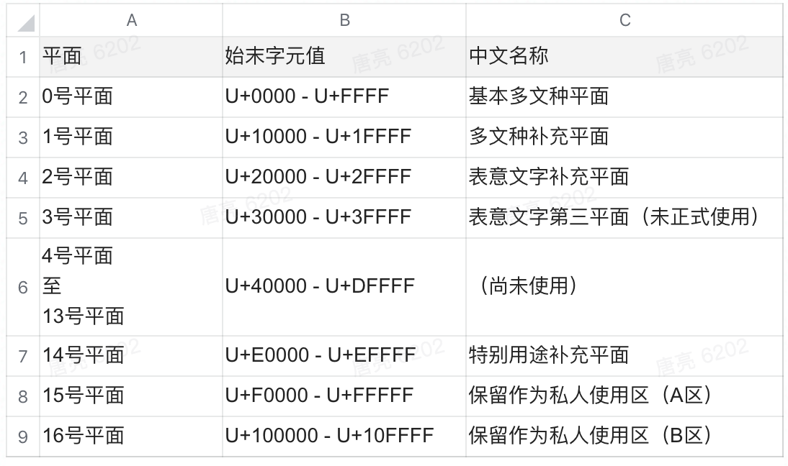
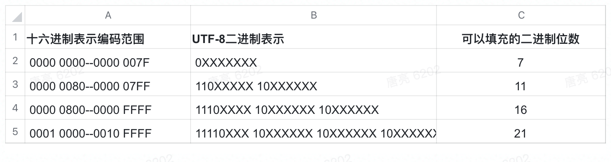
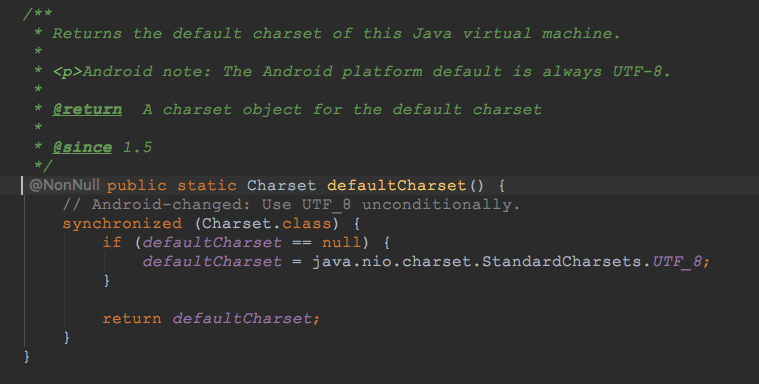
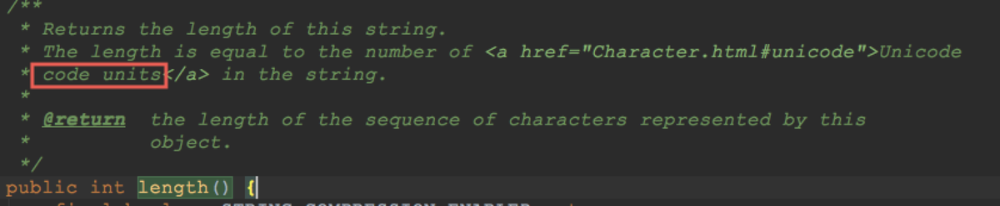
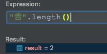
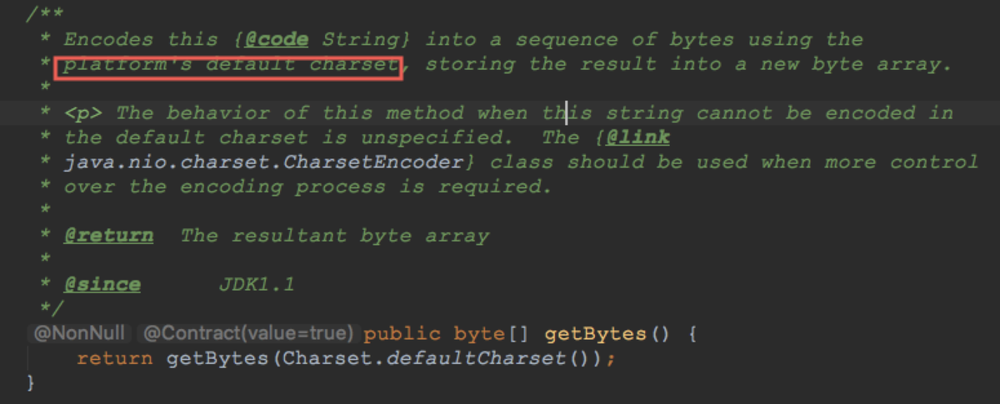
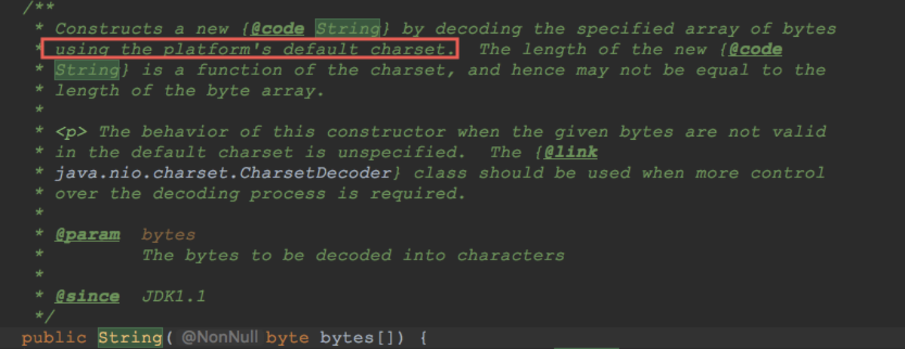
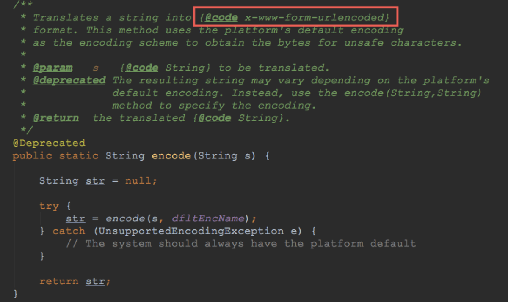

------------

## Unicode的前因后果

计算机没法直接处理文本，它只和0 1数字打交道。为了在计算机里用数字表示文本，我们指定了一个从字符到数字的映射。这个映射就叫做编码（encoding）。


**1967年**，字符编码**ASCII**正式发布。ASCII 码是 7 位的，它将英文字母，数字 0-9 以及一些标点符号和控制字符映射为 0-127 这些整型。 英语用 128 个字符来编码完全是足够的，但是用来表示其他语言，128 个字符是远远不够的。亚洲语言有更多的字符需要被存储，一个字节已经不够用了。于是，人们开始使用两个字节来存储字符。

各种各样不统一的编码方式成了系统开发者的噩梦，他们提出了一个**“内码表”**的概念，可以切换到相应语言的一个内码表，这样才能显示相应语言的字母。如果你在一台机器上写了一段文字，然后在另一台使用了不同的内码表的机器上打开就会显示出错误。在这种情况下，如果使用多语种，那么就需要频繁的在内码表内进行切换。

**1987年**，来自几个大的科技公司（其中包括苹果和 NeXT）的工程师们开始合作致力于开发一种能在全世界所有书写系统中通用的字符编码系统，于 1991 年 10 月发布的 1.0.0 版本的 Unicode 标准就是这一努力的成果。


**Unicode** 是一本很厚的字典，为世界上几乎所有的书写系统里所使用的每一个字符或符号定义了一个唯一的数字。这个数字叫做**码点（code points）**。最初，Unicode 编码是被设计为 16 位的，提供了 65,536 个字符的空间。后来考虑到要编码历史上的文字以及一些很少使用的日本汉字和**中国汉字**，Unicode 编码扩展到了 21 位（从 U+0000 到 U+**10FFFF**），这 21 位提供了 1,114,112 个码点，其中，只有大概 10% 正在使用，还有很大的扩充空间。




Unicode编码空间被分成 17(1+2^4)个**平面**，每个平面有 65,536 (2^16)个字符。0 号平面叫做**「基本多文种平面」**，涵盖了几乎所有你能遇到的字符，**除了 emoji**。其它平面叫做辅助平面，大多是空的。


## Unicode编码解码

Unicode的实现方式称为Unicode转换格式（Unicode Transformation Format，简称为UTF）。

### UTF-8

UTF-8 是目前互联网上使用最广泛的一种 Unicode 编码方式，实现了对 ASCII 码的向后兼容。它的最大特点就是可变长，它可以使用 1 - 4 个字节表示一个字符，根据字符的不同变换长度。编码规则如下：


1、对于单个字节的字符，第一位设为 0，后面的 7 位对应这个字符的 Unicode 码点。因此，对于英文中的 0 - 127 号字符，与 ASCII 码完全相同。意味着 ASCII 码用 UTF-8 编码兼容完全没有问题。


2、对于需要使用 N 个字节来表示的字符（N > 1），第一个字节的前 N 位都设为 1，第 N + 1 位设为0，剩余的 N - 1 个字节的前两位都设位 10，剩下的二进制位则使用这个字符的 Unicode 码点来填充。





“汉”的 Unicode 码点是 0x6c49（110 1100 0100 1001），0x6c49 需要15位二进制位数，那么得出其格式为 1110xxxx 10xxxxxx 10xxxxxx。接着，从“汉”的二进制数最后一位开始，从后向前依次填充对应格式中的 x，多出的 x 用 0 补上。这样，就得到了“汉”的 UTF-8 编码为 11100110 10110001 10001001，转换成十六进制就是 0xE6 0xB1 0x89。  


解码的过程也十分简单：如果一个字节的第一位是 0 ，则说明这个字节对应一个字符；如果一个字节的第一位1，那么连续有多少个 1，就表示该字符占用多少个字节


### UTF-16

UTF-16 编码介于 UTF-32 与 UTF-8 之间，同时结合了定长和变长两种编码方法的特点。编码规则：**基本平面的字符占用 2 个字节（U+0000 到 U+FFFF），辅助平面的字符占用 4 个字节（U+010000 到 U+10FFFF）**。

当我们遇到两个字节时，到底是把这两个字节当作一个字符还是与后面的两个字节一起当作一个字符呢？

辅助平面的字符位共有 2^20 (2^4个平面，每个里面 2^16)个，因此表示这些字符至少需要 20 个二进制位。UTF-16 将这 20 个二进制位分成两半，前 10 位映射在 U+D800 到 U+DBFF，称为高位（H），后 10 位映射在 U+DC00 到 U+DFFF，称为低位（L），剩下的6位当做标志来区分基本平面和辅助 平面。这意味着，一个辅助平面的字符，被拆成两个基本平面的字符表示。


为了配合UTF-16，Unicode中也将这两个区间屏蔽掉，不允许分配任何字符

1101 10xx xxxx xxxx，区间就是D800~DBFF

1101 11xx xxxx xxxx，区间就是DC00~DFFF


### UTF-32

UTF-32每个码点上使用整 32 位。32 大于 21，因此每一个 UTF-32 值都可以直接表示对应的码点。尽管简单，UTF-32却几乎从来不在实际中使用，因为每个字符占用 4 字节太浪费空间了。


## Unicode中的Emoji

> 1999年前后，日本一个名叫栗田穰崇的年轻人，和许多直男一样， 给女友发的短信经常会被误解。比如，“知道了”被解读成“生气了”、“不耐烦了”，随后引发冷战。 于是少年栗田想：“如果能在文字里插入一些表情符号来表达感情，大家应该会需要吧！”

> 原始的Emoji就这么诞生了。

### Emoji的编码

在普通的聊天软件中，一些基本表情是采用普通字符的转义表示。比如在字符串中检测到[微笑]，就自动替换为表情图片。

但是Emoji是一种特殊的字符，它是真正被编码入Unicode的字符。大部分Emoji在字符集里处于U+1F300到U+1F9EF中的部分范围（1号平面）。

### Unicode组合字符

Unicode 包含一个系统，可以合并多个编码点，动态组合字符。此系统用各种方式增加灵活性，而不引起编码点的巨大组合膨胀。


用户认为的一个“字符” 事实上底下可能由多个编码点组成。Unicode 使用「字位簇」的概念来表示这种情况。一个由一个或多个编码点组成的字符串构成一个 “用户感知的字符”。


字位簇主要被用在文本编辑：它们对光标和文本选择来说是最明显的单元。使用字位簇，确保在复制和粘贴文本时不会突然丢掉一些符号，同时左右方向键也总是以一个可见字符的距离移动，等等。

[更多Emoji组合字符信息](https://juejin.im/post/5c00b31a5188251d9e0c4a59)


代码示例：

```
val smile  =  "😀"

print("smile emoji length = ${smile.length}")

val flag = "🇨🇳"

print("flag emoji length = ${flag.length}")

val portrait = "👩🏽‍🦳"

print("portrait emoji length = ${portrait.length}")

val family = "👨‍👩‍👧‍👧"

print("family emoji length = ${family.length}")


smile emoji length = 2 

flag emoji length = 4 

portrait emoji length = 7 

family emoji length = 11
```

### 

## Java/Android与Unicode

Java最初设计的Charactor用两个字节来表示unicode字符，这没有问题， 因为最初unicode只有16位并且字符还比较少，但是Unicode 4.0(事实上自Unicode 3.1), 字符集进行很大的扩充，已经达到了96,447个字符，Unicode 11.0已经包含137,374个字符，2^16已经远远不够存储了。


### Java编码方式：JVM之外和JVM之内

JVM之外：Java源文件(.java)和编译后的.class文件，源文件可以采用多种编码格式如utf-8(unix linux平台默认) 或者gbk(windows平台默认)，当将源码用javac编译的时候，**默认是javac按照系统默认的编码格式读取java源文件**， 然后以utf-8的格式输出到.class文件中，换句话说，在默认情况下unix平台，javac用utf-8格式读取java源文件 然后以utf-8格式写.class；在默认情况下windows平台，javac用gbk格式读取java源文件然后以utf-8格式写.class

如果源文件的编码格式不采用操作系统默认格式可能会导致错误表现，在windows平台下用utf-8格式保存java源文件，如果不采用Ide(Ide会智能根据文件编码格式告诉javac用正确的方式)，直接用javac编译该源文件，则会造成乱码（文件保存编码格式和读取编码格式的不匹配）


JVM之内：当运行java字节码时，读入到内存里的字符或者字符串全部都用char或char[]表示，而char是采用UTF-16的 


### Android编码方式

Android系统是基于linux内核的，所以默认的Unicode编码方式为UTF-8




### 开发中处理Unicode

- > **Code Point**: 代码点，一个字符的数字表示。一个字符集一般可以用一张或多张由多个行和多个列所构成的二维表来表示。二维表中行与列交叉的点称之为代码点，每个码点分配一个唯一的编号数字，称之为码点值或码点编号，除开某些特殊区域(比如代理区、专用区)的非字符代码点和保留代码点，每个代码点唯一对应于一个字符。 从U+0000 到 U+10FFFF。

- > **Code Unit**：代码单元，是指一个已编码的文本中具有最短的比特组合的单元。对于 UTF-8 来说，代码单元是 8 比特长；对于 UTF-16 来说，代码单元是 16 比特长。换一种说法就是 UTF-8 的是以一个字节为最小单位的，UTF-16 是以两个字节为最小单位的。


Java的字符在内部以UTF-16编码方式来表示，当字符的Code Point在0号平面，一个Code Unit就能标识字符。**日常开发中需要注意的是一些不常用汉字和emoji，他们会占用多个****Code Unit****。**





String.length返回的是Code Unit的长度，而不是Unicode中字符的长度。对于0号平面的代码点，String.length和我们传统理解的字符的数量是一致的，对于扩展的字符，String.length可能是我们理解的字符长度的两倍，组合字符可能会有更多变化。

以汉字”𠮷”为例，汉字”𠮷”的 Unicode 码点为 0x20BB7，该码点超出了基本平面的范围（0x0000 - 0xFFFF），因此需要使用四个字节表示。


所以我们平时在进行字符串截取的时候，不能太过依赖String.length的结果，尤其是经常使用的emojis字符。


自 Java 1.5 java.lang.String就提供了Code Point相关方法， 用来获取完整的Unicode字符和Unicode字符数量:

- public int codePointAt(int index)    //获取index代码点的十进制表示
- public int codePointBefore(int index)     //获取index-1代码点的十进制表示
- **public int codePointCount(int beginIndex, int endIndex)**      //获取beginIndex到endIndex之间的**代码点数量**
- **public default IntStream codePoints()**   String.codePoints().toArray()可以得到代码点的十进制数组

注意这些方法中的index使用的是code unit值。


### 编码方式的encode/decode

利用String.getBytes() 和 new String() 来进行编码转换





  

```
String s="你好";


byte[] bytes=s.getBytes();//andorid平台默认是utf-8,编码每个字符占3个字节

System.out.println(Arrays.toString(bytes));//[-28, -67, -96, -27, -91, -67]


String s1=new String(s.getBytes("utf-8"), "gbk");//浣犲ソ

String s1=new String(s.getBytes("gbk"), "utf-8");//???


//正确转码方式

return new String( s.getBytes("utf-8") , "utf-8");
```


URLEncoder.*encode*(url)/URLDecoder.*decode*(url) 



