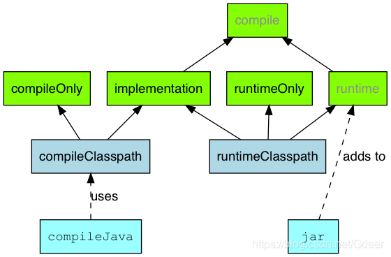
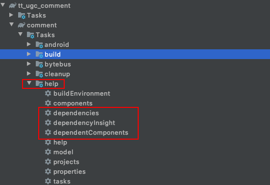
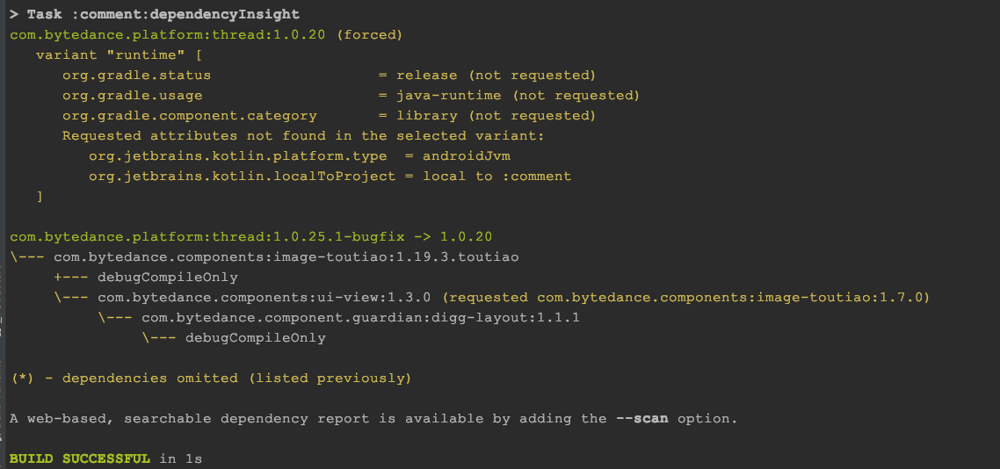
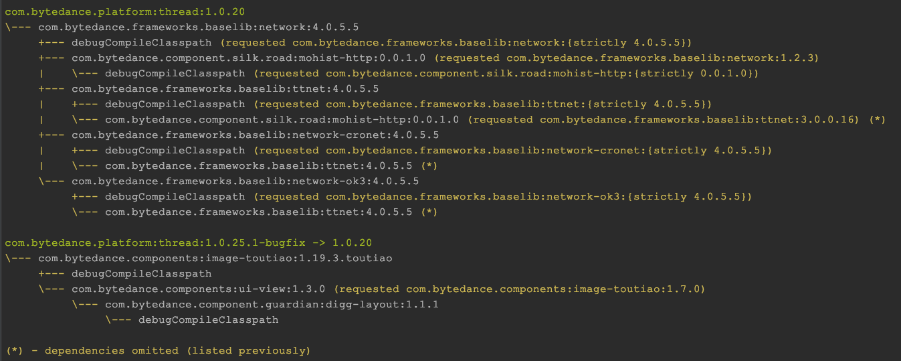
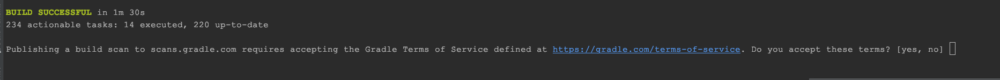
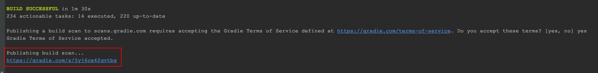
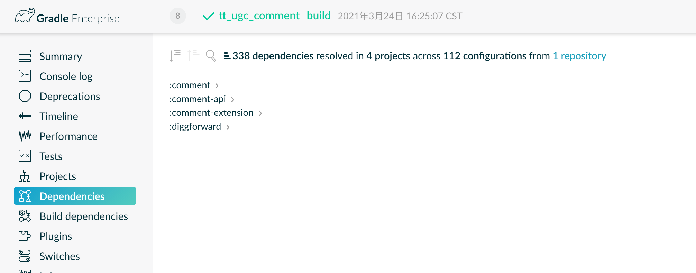
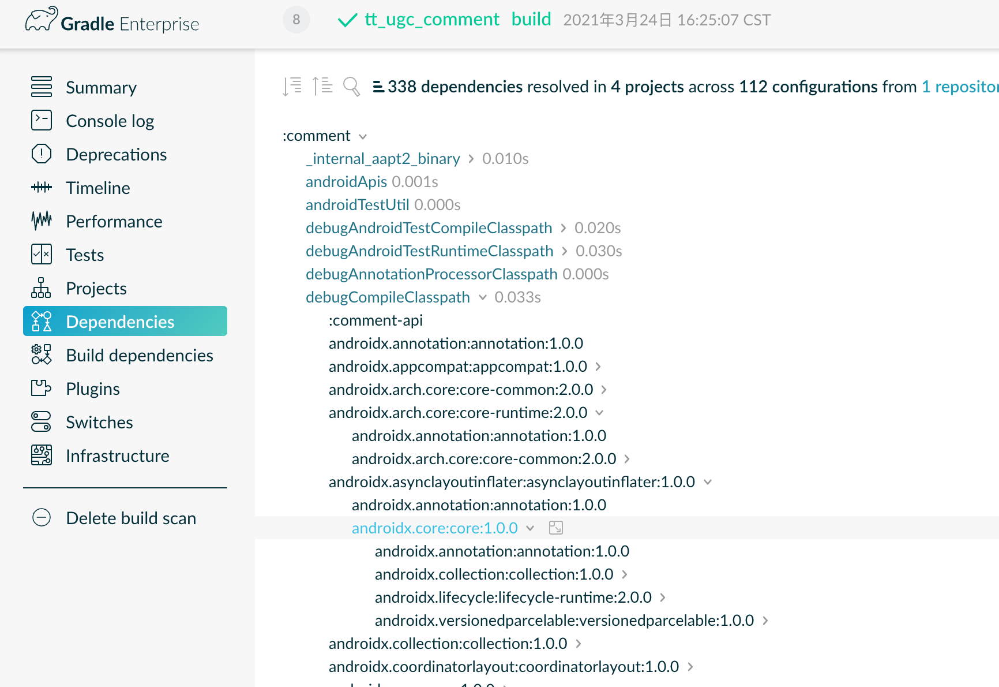

## 依赖关系展示

```
apiDependenciesMetadata
...
debugCompileClasspath - Compile classpath for compilation 'debug' (target  (androidJvm))
...
debugCompileOnly - Compile only dependencies for compilation 'debug' (target  (androidJvm)).
...
releaseCompileClasspath - Compile classpath for compilation 'release' (target  (androidJvm)).
...
implementation - Implementation only dependencies for 'main' sources. (n)
...
releaseRuntimeClasspath - Runtime classpath of compilation 'release' (target  (androidJvm)).
...
```

依赖关系的展示路径包含依赖方式(configuration)+编译变体的组合：

1. 依赖方式(可单独配置展示)：CompileClasspath编译时、RuntimeClasspath运行时、CompileOnly、RuntimeOnly、等



2. 编译变体：Build Type+Product Flavor，没有flavor为debug、release、test等。如果有flavor则为toutiaoDebug、liteRelease等

例如：debugCompileOnly、releaseCompileClasspath等

## 查看依赖关系的方式

### 一、命令行：

```
./gradlew ${module}:dependencies
```

列出该模块下所有第三方类库的依赖树组合

如果只想输入特定组合的依赖树，可以使用--configuration配置

```
//仅输入debugCompileOnly的依赖关系

./gradlew ${module}:dependencies --configuration debugCompileOnly 
```


### 二、Gradle插件：



**dependencies**：与命令行操作一致，输出模块的所有依赖

**dependencyInsight**：解释依赖树中的一个依赖如何被选择，为什么被选择(逆向打印依赖关系)。可用作"Could not resolve com.xxx:okhttp:{strictly 3.0.0}"版本号冲突问题的排查

```
//thread为第三方依赖库

//图1 debugCompileOnly  CompileOnly依赖路径

./gradlew comment:dependencyInsight --dependency thread --configuration debugCompileOnly


//图2 debugCompileClasspath   编译期依赖路径

./gradlew comment:dependencyInsight --dependency thread --configuration debugCompileClasspath
```






### 三、Gradle官方构建分析页面

如果嫌弃命令行窗口查看依赖树不友好，或者需要查看整个工程项目的依赖树时，有一种方式可以到HTML网页查看依赖树

```
./gradlew build --scan
```

在工程根目录输入这个命令后，会出现如下：



输入yes后会在Gradle官方页面生成构建页面



用任意邮箱登录后可更方便的查看整个项目的依赖关系




## 依赖关系分析

```
+--- androidx.recyclerview:recyclerview:1.0.0
|    +--- androidx.annotation:annotation:1.0.0
|    +--- androidx.core:core:1.0.0
|    |    +--- androidx.annotation:annotation:1.0.0
|    |    +--- androidx.collection:collection:1.0.0
|    |    |    \--- androidx.annotation:annotation:1.0.0
|    |    +--- androidx.lifecycle:lifecycle-runtime:2.0.0
|    |    |    +--- androidx.lifecycle:lifecycle-common:2.0.0
|    |    |    |    \--- androidx.annotation:annotation:1.0.0
|    |    |    +--- androidx.arch.core:core-common:2.0.0
|    |    |    |    \--- androidx.annotation:annotation:1.0.0
|    |    |    \--- androidx.annotation:annotation:1.0.0
|    |    \--- androidx.versionedparcelable:versionedparcelable:1.0.0
|    |         +--- androidx.annotation:annotation:1.0.0
|    |         \--- androidx.collection:collection:1.0.0 (*)
|    \--- androidx.legacy:legacy-support-core-ui:1.0.0
......
```

**符号定义：**

- +- - - 是依赖分支库的开始。
- | 标识还是在之前的依赖库中的依赖，显示它依赖的库。
- \- - - 是依赖库的末尾。
- (*)意味着该库的进一步依赖关系不会显示，因为它们已经列在其他某个子依赖树中
- ->Gradle 发现多个依赖库都依赖到同一个库但是不同版本，强制转换版本，可体现源码依赖