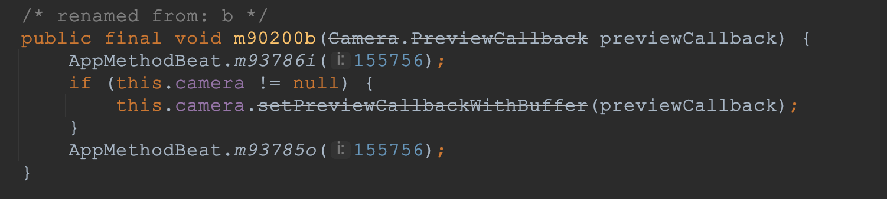
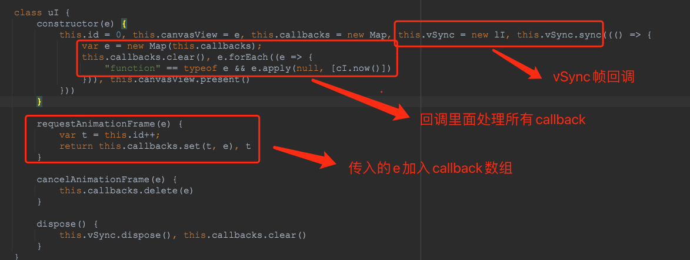

## **小程序底层框架** 


### **双线程模型** 

        

​        

| **运行环境**     | **逻辑层(JS引擎)** | **渲染层(渲染引擎)** |
| ---------------- | ------------------ | -------------------- |
| Android          | V8                 | Chromium 定制内核    |
| iOS              | JavaScriptCore     | WKWebView            |
| 小程序开发者工具 | NWJS               | Chrome WebView       |


## **逆向技巧：查看小程序源码** 


### **1、获取小程序基础库wxvpkg包(****微信开发者工具****)** 

想要获取小程序的源码需要先拿到小程序的应用包，最简单的包获取方式是在**微信开发者工具**中的基础库包 

1. 把终端的对象切换为top，输入help()可以查看工具提供的一些方法： 


2. 输入openVendor()打开所有下载过的基础库版本的目录                          

- wcsc：将 wxss 转为 view 模块使用的 css 代码 

- wcc：将 wxml 转为 view 模块使用的 js 代码

- wxvpkg：基础库包(微信开发者工具使用) 

### **2、获取安卓手机的小程序wxapkg包** 

众所周知，开源的安卓系统可以做到很多其他平台做不到的黑科技。 

其实只要拿到了ROOT权限，我们就可以对手机"为所欲为"。 

不一定每个人都用安卓手机，并且真机刷ROOT比较麻烦(有几率变砖块)，我们最好用安卓模拟器去操作 

1. 打开"夜神模拟器"的ROOT权限，下载[文件管理器](https://jiazhang.qq.com/static/utils/rootexplorer.apk)

1. ​                         登录微信并打开想要逆向的小程序应用，微信客户端会下载对应的小程序包到data/data/com.tencent.mm/microMsg/xxxxxxxxxx长字符串/appbrand/pkg目录下(无ROOT权限只能查看到/sdcard目录) 

1. ​                         长按文件选择压缩=>发送压缩文件到微信 

### **3、解包小程序基础库** 

1. 利用wxappUnpacker解包工具解析wxapkg格式的包文件(微信开发中工具获取的wx**v**pkg包需把后缀改成wx**a**pkg)，得到压缩混淆后的基础库源码 

1. ​            webstorm打开源码工程，利用webstorm的格式化得到勉强能阅读的代码                          小程序基础库用JavaScript编写，其中WAServiece 就是逻辑层代码，WAWebview 是渲染层代码，他们会被注入到平台对应的渲染层和逻辑层环境中运行 

### **4、反编译微信app获取小程序基础库代码** 

利用安卓反编译工具解包微信apk，在wxa_library目录下可以找到小程序基础库的js代码以及其他注入代码

        

##                  **部分源码浅析** 

### **setTimeout在安卓中的实现** 

- 我们反编译wx的apk，在appbrand包目录下可以找到setTimeout、setInterval等定时器方法的注入代码（V8 本身是不提供 setTimeout 和 setInterval，它们不是ECMAScript 的一部分） 

- ​                         可以通过registerJavaMethod方法搜索有哪些小程序方法是通过注入Java对象方式实现的。例如console.log... 

- ​                         J2V8是基于 jni 实现了 Java 对 V8 的封装，微信内部改写了J2V8。 
- v8Object是定义了众多Java方法实现的对象，最终会通过addJavascriptInterface注入到JS引擎中。 

- ​                         addJavascriptInterface的作用是在WebView中注入Java对象，供给JS端通过JSBridge调用Android端的方法。 
- 所以registerJavaMethod中JavaCallback的实现就是最终小程序setTimeout方法的实现 

- ​                         setTimeout方法具体实现：解析参数封装成runnable，send到安卓handle中处理(handle对应的loop是小程序运行线程V8JSRuntimeLooper) 

### **cameraContext.onCameraFrame的背压卡顿问题** 

**本质原因是onCameraFrame的回调任务优先级比setTimeout、setInterval等默认任务优先级要高**

onCameraFrame的调用路径： 

1. 原生camera的setPreviewCallbackWithBuffer()方法，启动相机预览，每产生一帧都会回调到onPreviewFrame() 方法 

1. ​                                                  onPreviewFrame里面会调用AppBrandCameraPluginLayout.onFrameData(byte[] bArr)，执行小程序的回调逻辑 

1. ​                         后面的链路会处理帧数据并且通过HandlerThread处理runnable，最终通过evaluateJavascript调用js方法执行小程序的onCamera回调 

​                         **V8JSRuntimeLooper的线程优先级：**

小程序在前台状态: 优先级为**-2**

​                         小程序在后台状态：优先级为**10**

​                         最终链路是通过Process.*setThreadPriority方法设置了**V8JSRuntimeLooper**的优先级*

​                         **验证：查看安卓linux层线程优先级：**

adb shell ps -A | grep [包名]找到小程序进程对应的PID                          

打开跳绳页面，adb shell top -H -p PID查看线程优先级                          关注PR(PRI)和NI两个字段：NI 是优先值，是用户层面的概念， PR是进程的实际优先级， 是给内核(kernel)看(用)的。一般情况下，PR=NI+20, 如果一个进程的优先级PR是18， 那么它的NI(nice)值就是18-20=-2 

- RenderThread是安卓渲染线程优先级为-10 
- JSRuntimeLooper线程的优先级为-2，把小程序切到后台后优先级变为10 

​                         

**总结：** 


**解决方法：** 

把执行代码放到setTimeout、setInterval、nixtTick...等非高优队列 

### **setData** 

**官方建议:**

1.不要过于频繁调用setData，应考虑将多次setData合并成一次setData调用； 

2.数据通信的性能与数据量正相关，因而如果有一些数据字段不在界面中展示且数据结构比较复杂或包含长字符串，则不应使用setData来设置这些数据； 

3.与界面渲染无关的数据最好不要设置在data中，可以考虑设置在page对象的其他字段下。 

4.去掉不必要的事件绑定（WXML中的bind和catch），从而减少通信的数据量和次数； 

5.事件绑定时需要传输target和currentTarget的dataset，因而不要在节点的data前缀属性中放置过大的数据 

**setData逻辑层源码定义:**                         


```
// 源码翻译

key: "setData", value: function (data, callback) {

  var _this = this;

  try {

      var dataObject = k(data);  // 转为Object

      if ('Object' !== object) return void D('类型错误', 'setData accepts an Object rather than some ' + dataObject);

      

      Object.keys(data).forEach(function (key) {

        void 0 === data[key] && D('Page setData warning', 'Setting data field "' + t + '" to undefined is invalid.');

        var keyList = V(key),  // 解析key对象/数组

        // n.data：page.data的深拷贝副本

         var o = G(n.data, keyList),   

         var i = o.obj,

         var a = o.key;

        if ((i && (i[a] = v(data[item])), void 0 !== data[key])) {

        // n.__viewData__：page.data的深拷贝副本

          var s = G(n.__viewData__, keyList),  

            c = s.obj,

            u = s.key;

          c && (c[u] = v(data[item]));

        }

      }),

        __appServiceSDK__.traceBeginEvent('Framework', 'DataEmitter::emit'),

        this.__wxComponentInst__.setData(JSON.parse(JSON.stringify(data)), callback),

        __appServiceSDK__.traceEndEvent();

    } catch (e) {

      M(e);

    }

}


k = function (data) {

  return Object.prototype.toString.call(data).split(" ")[1].split("]")[0]

} 


// 解析Key, 保存对象/数组的值。 例如 a.b.c=> [a,b,c]、a[0].b=>[a,0,b]

V = function (key) {

        if ("String" !== k(e)) throw D("数据路径错误", "Path must be a string"), 

        new L("Path must be a string");

        for (var t = e.length, n = [], r = "", o = 0, i = !1, a = !1, s = 0; s < t; s++) {

            var c = e[s];

            if ("\\" === c) s + 1 < t && ("." === e[s + 1] || "[" === e[s + 1] || "]" === e[s + 1]) ? (r += e[s + 1], s++) : r += "\\"; else if ("." === c) r && (n.push(r), r = ""); else if ("[" === c) {

                if (r && (n.push(r), r = ""), 0 === n.length) throw D("数据路径错误", "Path can not start with []: " + e), new L("Path can not start with []: " + e);

                a = !0, i = !1

            } else if ("]" === c) {

                if (!i) throw D("数据路径错误", "Must have number in []: " + e), new L("Must have number in []: " + e);

                a = !1, n.push(o), o = 0

            } else if (a) {

                if (c < "0" || c > "9") throw D("数据路径错误", "Only number 0-9 could inside []: " + e), new L("Only number 0-9 could inside []: " + e);

                i = !0, o = 10 * o + c.charCodeAt(0) - 48

            } else r += c

        }

        if (r && n.push(r), 0 === n.length) throw D("数据路径错误", "Path can not be empty"), new L("Path can not be empty");

        return n

    }
```


**一些结论：**

setData是局部刷新，层次比较深的数据结构(a.b.c.d)的改动是通过局部复制=>赋值到全局Data来实现，当仅改动到对象/数组的某一个属性时，不要setData整个对象/数组。 

### **nextTick**                          [关于nextTick“下个时间片”是指逻辑层的“下个时间片”还是指等渲染层渲染完的“下个时间片”？](https://developers.weixin.qq.com/community/develop/doc/000a02e8fe061847c23aef70151000?highLine=wx.nextTick)

**nextTick方法源码：**

- ​                         requestAnimationFrame通常是指VSYNC信号的帧回调，所以nextTick与setTimeout有本质上的区别 
- 源码有些地方会利用setTimeout(l, 16)来兜底实现帧回调 

​                         

**Canvas.requestAnimationFrame方法实现(安卓)：**

        不同平台对应不同的canvas实例和requestAnimationFrame实现 

老版本的webkit里没有requestAnimationFrame，逻辑层降级方案： 

        vSync逻辑层降级实现 

​                         