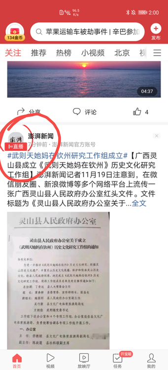

### 问题背景：

1. tt_ugc_business仓库ugc-view模块中直播头像相关的自定义View(UserAvatarLiveView)被多个非ugc业务方依赖，已经不适合放在ugc-view模块，所以计划迁移到更通用的Guadian仓库image模块
2. image模块是以flavor的形式在头条主端和lite端使用的，为了隔绝上层依赖独立仓库模块时需要配置flavor，独立仓库模块依赖image都是以**complieOnly**的形式。

3. ugc-view模块在xml文件中使用了UserAvatarLiveView类的自定义属性，compileOnly的依赖方式会导致image模块的资源文件无法引用从而打aar失败，所以ugc-view模块中用到image的资源被迫在模块中重新声明一遍才能打包通过。

**最终结果：ugc-view和image模块里都存在UserAvatarLiveView类自定义属性的声明（complieOnly的弊端）**

### 问题出现

迁移代码合入主端ttmain之后表现正常。

lite端同步升级ugc-view和image模块版本号之后，发现直播头像外框大小异常

### 问题排查

1. 找到对应宿主的类UserAvatarLiveView断点分析，dubug获取的外框属性值取到的是默认值76dp。

猜测是自定义属性值未生效导致

这个现象就比较奇怪了，同样的代码主端没问题，lite却拿不到对应的自定义属性值（如何去分析）

2. 排查发现UserAvatarLiveView类的attr的声明在ugc-view和image两个aar模块中都存在，而image模块是打包在lite宿主中的，ugc-view是打包在newugc插件中的，会不会是attr资源id没对应上呢

3. 分析宿主apk和插件apk中是否存在对应的属性id

宿主的R文件(1.2w行)和resources.arcs文件

newugc插件的R文件(1.6w行)和resources.arcs文件

可以看到宿主和插件中都存在对应属性的定义，并且插件中的属性id会被加上插件固定的前缀。

Mira框架打插件时会合并插件和宿主的R文件，资源名称冲突的非id类型资源会使用插件里的

如果在ugc-view模块的xml中设置自定义属性，属性字符串animation_live_circle_height会索引到插件的资源ID(0x36030004)

而插件中的ugc-view模块代码在使用宿主image模块的UserAvatarLiveView类时会根据宿主的资源ID(0x7f010134)去查找，由于属性ID(0x7f010134)并未被赋值，所以就使用了默认值76dp。

### 解决&总结

- 临时的解决方法是把ugc-view模块中xml文件用到的自定义属性全部删除，改成用java代码去设置属性值。这样就不存在属性声明重复导致的问题了。
- 问题的难点在于排查分析原因。该bug出现的前提条件较多，插件与宿主资源重复的场景也比较小，属于非常规case，如果没有正确的思路指引，排查起来会比较耗费精力。