------------

## 资源编译打包流程：

### 资源文件分类

- assets
- res：*animator、anim、color、drawable、layout、menu、values、xml、raw*

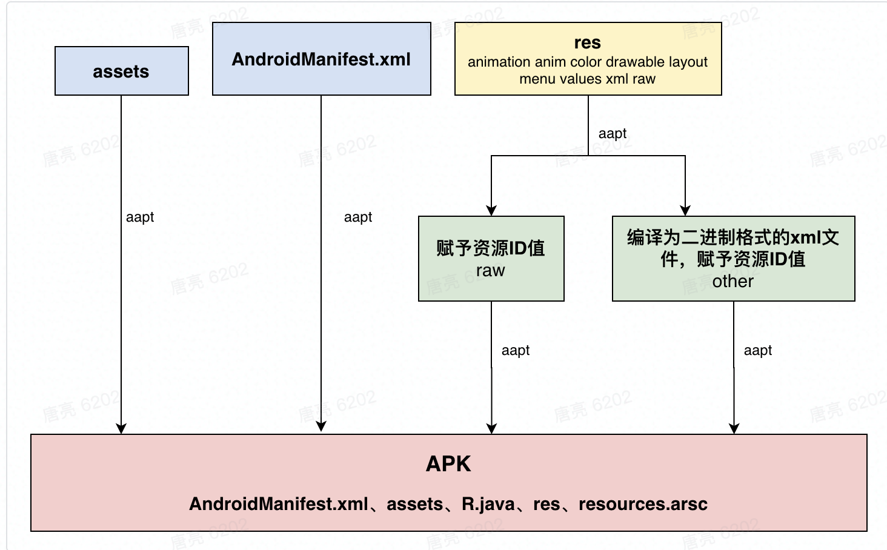

- res文件夹下除了图片文件和res/raw目录的资源，其他资源均会从文本格式的xml文件编译成二进制格式的xml文件
- 二进制的xml文件占用空间小，解析速度快。所有的xml标签、属性名称、属性值都会收敛到统一的资源池中，并且会去重。
- 资源池中会赋予每个非assets资源一个整数ID值，这些ID值以常量/静态变量的形式定义在R.java文件中，并生成resources.arsc文件，用来描述ID值对应资源的配置信息，相当于是一个资源索引表

### AAPT(Android Asset Packaging Tool)流程：

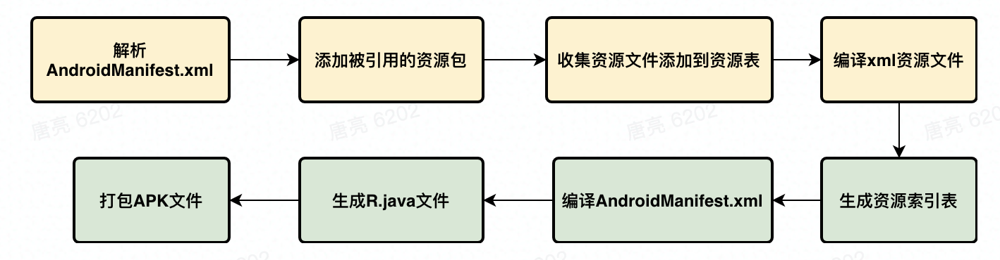

**资源表的概念**：aapt在编译应用资源时，会创建一个资源表(使用**ResourceTable**对象来描述)，在应用程序资源编译完成之后，它就会包含所有资源的信息。有这个资源表之后，aapt就可以根据它的内容来生成资源索引表文件resources.arsc了。

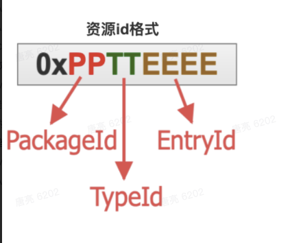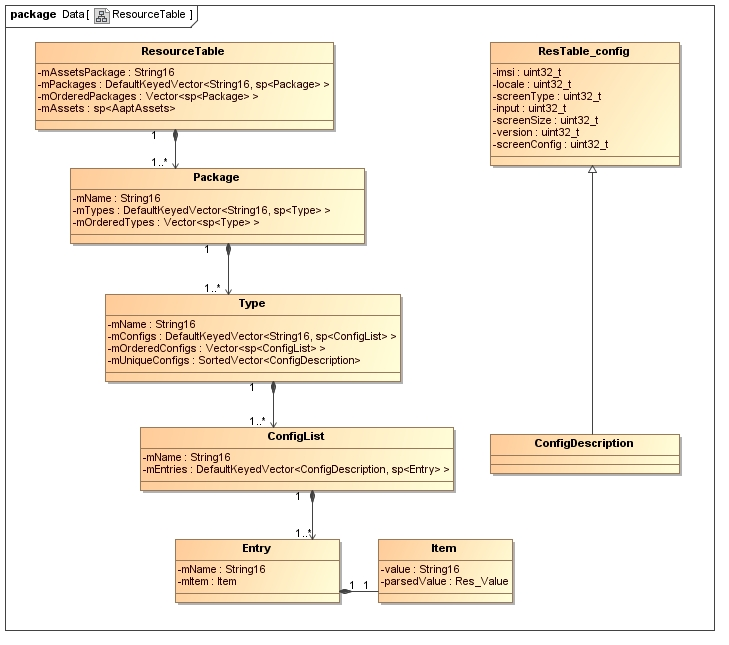

1. **解析AndroidManifest.xml：**根据package属性值拿到包名并创建一个**ResourceTable**对象
2. **添加被引用的资源包：**除了应用程序的资源包外，我们通常会引用到系统资源包，例如android:layout_height属性的值为“match_parent”，match_parent实际上就是系统资源包里定义的一个值。系统资源包的packageId等于0x01，应用程序资源包的packageId等于0x7f，每一个资源包都用一个Package对象来描述。
3. **收集资源文件添加到资源表：**根据资源的类型(drawable、layout等)创建对应的ResourceTypeSet，把不同type的资源项(用Entry对象描述)添加到对应的ResourceTypeSet中，然后将所有的ResourceTypeSet对象都添加到ResourceTable.Package对象中。至此资源表中资源项的资源ID都可以确定了，由PackageId+TypeId+EntryId(表中的index)决定
4. **编译Xml资源文件：**经历过上述的步骤之后，为编译xml文件做好了所有的准备。

- 解析xml：解析xml为内存中的树形结构XMLNode类，每一个XMLNode代表了一个XML元素
- 赋予属性名称资源ID：给每一个属性名称赋予资源ID。这一步操作会从跟节点开始递归，读取内存中**ResourceTable**对象获取资源ID。系统定义的属性(android:layout_height)赋予0x01XXXXXX，应用程序内定义的属性(**自定义属性**)赋予0x7fXXXXXX
- 解析属性值：这一步是针对属性名称的值进行解析。对于引用类型的属性值例如@+id/test，如果资源表对应的包中没有test资源，则会增加类型为id的Entry到资源包里
- xml文件转换为二进制格式：前面的步骤将所有的资源都解析完毕，接下来将解析过的资源收集起来写入二进制文件

1. **生成资源索引表resources.arsc：**读取内存中的资源表-收集类型字符串-收集资源项名称字符串-收集资源项值字符串-生成Package数据-依次写入资源索引表

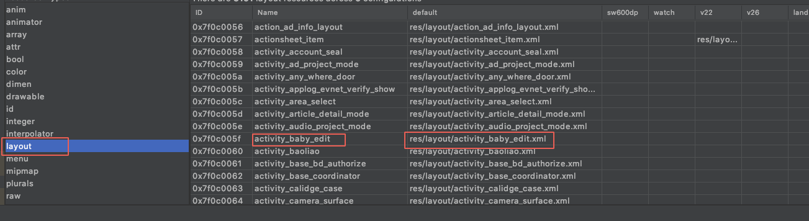

1. **编译AndroidManifest.xml文件：**编译过程与其它的xml资源文件的编译过程一致，之所以要在应用程序的所有资源项都编译完成之后，再编译应用程序的配置文件，是因为后者可能会引用到前者。
2. **生成R.java文件：**在前面的步骤中，已经将所有的资源项及其所对应的资源ID都收集起来了，这里只要直接将它们写入到指定的R.java文件去就可以了。
3. **打包到APK文件：**所有资源都编译完成，可以打包到apk文件中了。

包括assets目录、资源项索引文件resources.arsc、res目录(不包含res/value目录，因为该目录下的资源比较简单，直接写到了resources.arsc文件里)。

除了这些资源文件外，应用程序的配置文件AndroidManifest.xml以及应用程序代码文件classes.dex，还有用来描述应用程序的签名信息的文件，也会一并被打包到APK文件中。

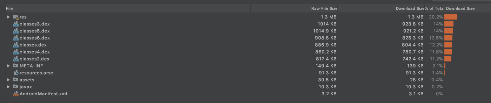

### AAPT2流程

从 AGP(Android Gradle Plugin) 3.0.0 开始，AAPT2 默认开启，也可以在配置文件中设置android.enableAapt2=false手动关闭

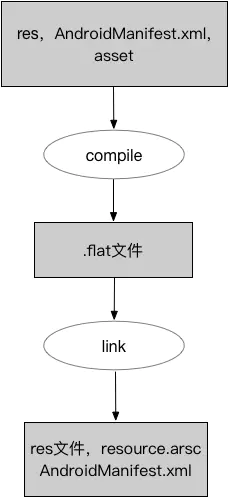

aapt只有一个编译过程，aapt2将资源编译分为编译-链接2个部分，实现资源文件的增量编译。

- **编译阶段：**解析资源文件并生成扩展名为.flat的中间二进制文件
- **链接阶段：**将编译阶段生成的所有中间文件(资源表、二进制XML文件和处理过的PNG文件)合并打包到APK文件中，此外在此阶段还可以生成其他辅助文件，如R.java文件和ProGurad规则文件。 

## 资源初始化

App在启动阶段调用AssetManager.addAssetPath(String path)方法把apk文件目录传递进去，将所有的apk信息保存到ApkAssets数组里

## 资源查找：

### **调用方式：**

- assets：AssetManager.open
- res：getString(resId)、getColor(resId)、getDrawable(resId)...

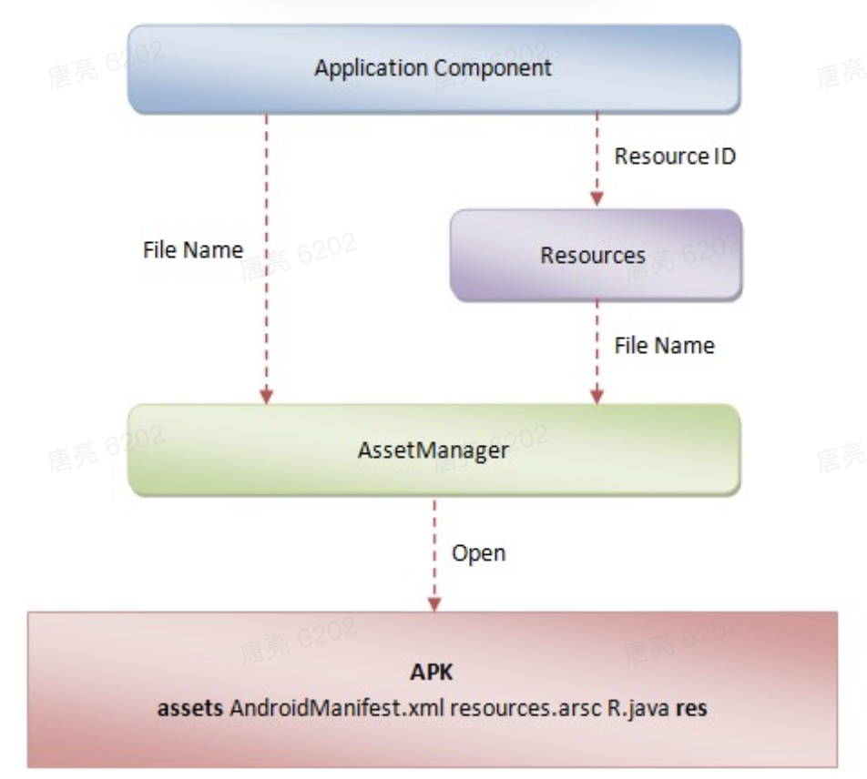

内部均是通过AssetManager去搜索apk里面的资源

### 调用关系图

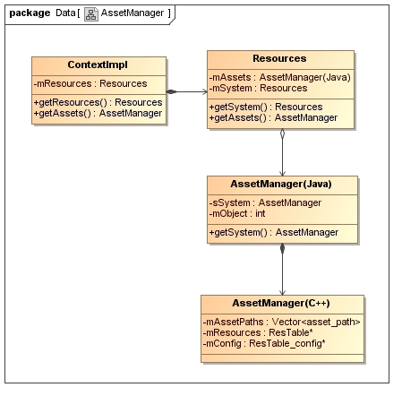

AssetManager(Java)：

Resources类不管通过什么方式获取资源，最终都是调用AssetManager.getResourceValue方法传入资源ID去查找资源值。getResourceValue再调用底层*nativeGetResourceValue方法*

AssetManager(C++)：

1. AssetManager.getResTable：依次解析应用程序的每一个resources.arcs文件，转换为Asset对象，并将解析完成的Asset对象都添加到ResTable对象中。ResTable对象类似aapt过程中的ResourceTable，里面包含了所有资源信息。
2. ResTable.getResource(resID...)：通过传入的资源的ID分别获得它的Package ID、Type ID以及Entry ID来查表找到对应的资源Entry

## 资源插件化

**为什么：资源插件化减少apk包大小**

通过前面的资源加载查找流程分析，正常情况下应用只能访问到自己apk的资源，四大组件的插件化虽然能加载到插件里面的activity，但插件里面的资源没有被加载到应用内存里面。

**怎么做：**

资源初始化阶段反射方式多次调用AssetManager.addAssetPath(String path)方法，把所有插件的apk路径传递进去。

构建一个全局的超级Resource对象，在查找时把所有调用到Resource的地方替换成全局的超级Resource对象。

新插件加载后引起全局资源变化，重新替换已存在Context实例的Resource、AssetManager

### 插件引用宿主的资源

在插件化中，宿主不会直接使用到插件里面的资源，通常是插件共享宿主的资源。

在插件的资源打包任务（processResourcesTask）完成之后将宿主的R.txt文件合并到插件的R.txt文件中，再将合并后的R.txt转成R.java文件并替换插件的R.java文件，这样插件中的R文件就会包含宿主的资源。

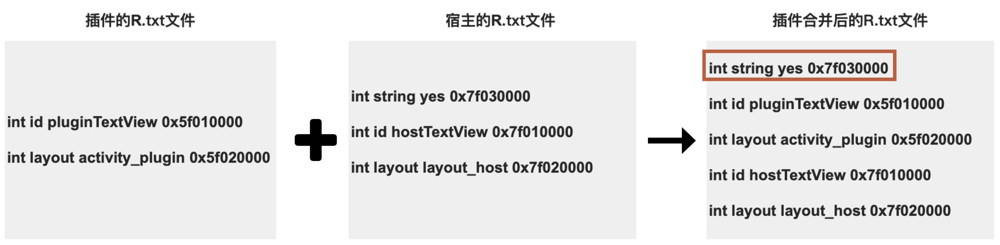

#### 可能遇到的问题

##### 资源ID冲突：

插件和宿主打包apk是独立的，无法保证生成的资源ID值不重复

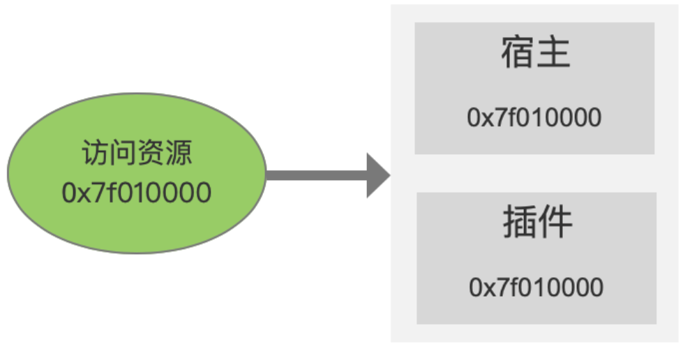

**资源ID重复有什么影响？**

资源查找流程底层源码：AssetManager.getResTable --> ResTable.getResource：

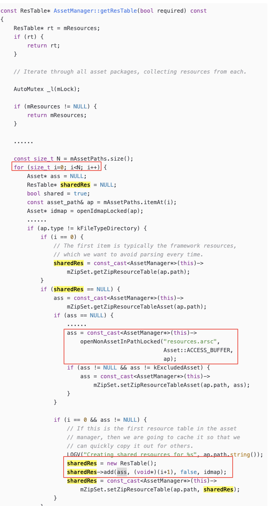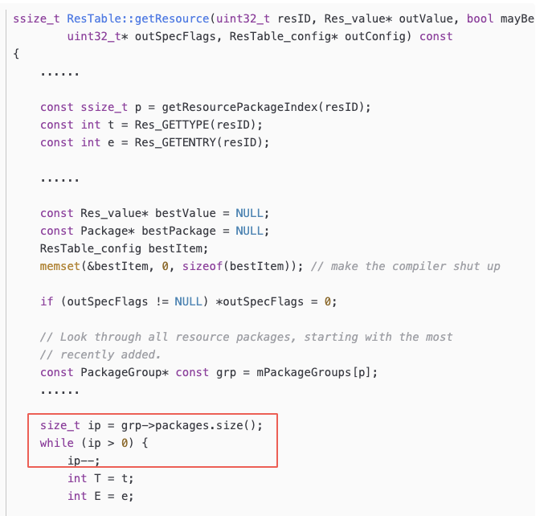

结论：查找资源时会优先返回后添加的插件资源，宿主的资源可能被插件覆盖

**解决办法：**

对插件的资源分区，修改插件的packageId与宿主区分

aapt1：修改aapt源码中生成资源id的逻辑、修改编译后的二进制资源文件

aapt2(AGP >= 3.0.0默认开启)：执行命令时添加--package-id xx

> 使用aapt2指定插件资源id的PP字段，需要buildToolsVersion >= 28.0.0

- > 在buildTools28.0.0版本之前，只支持指定资源id PP字段在0x7f-0xff范围内，尴尬的是Android 8.0之前不支持>0x7f的PP段资源。

- > buildTools28.0.0版本开始提供 --allow-reserved-package-id参数，可以指定0x02 -0x7e范围内的PP段资源。

--allow-reserved-package-id --package-id  xxxx

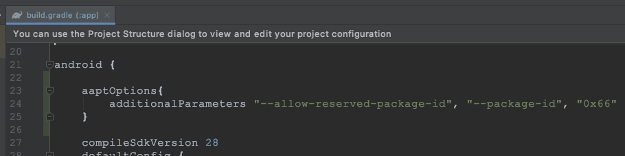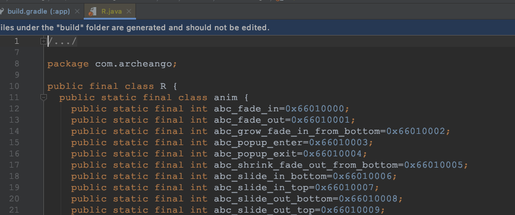

**mira实现：**通过gradle插件收集packageId，添加aapt编译命令参数

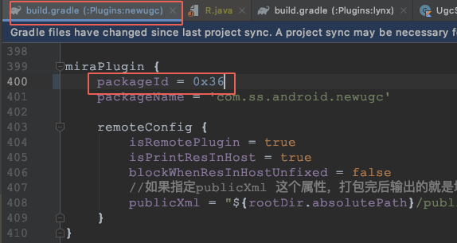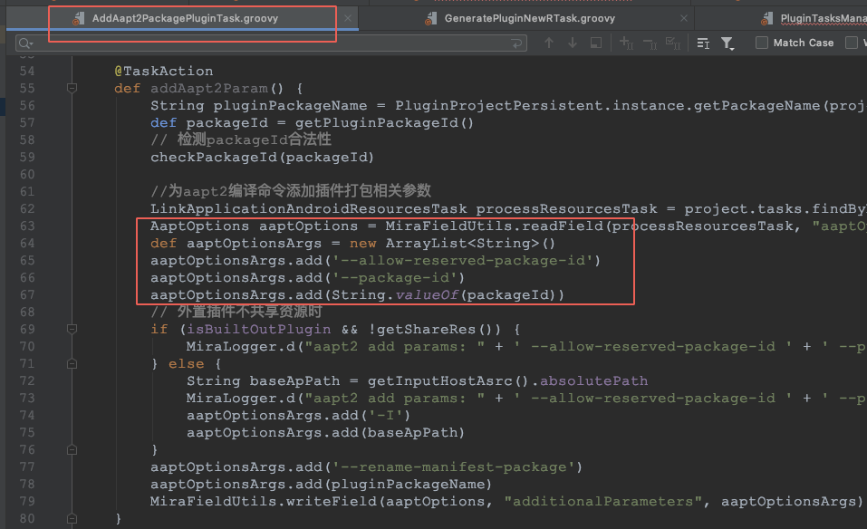

##### 资源固定

资源固定是为了使插件具备跨宿主版本的能力。

在打包插件时，会合并宿主当前版本的R文件，后续宿主包中有新增/删除资源时，宿主aapt编译生成的资源ID顺序改变，导致插件访问到错误的宿主资源

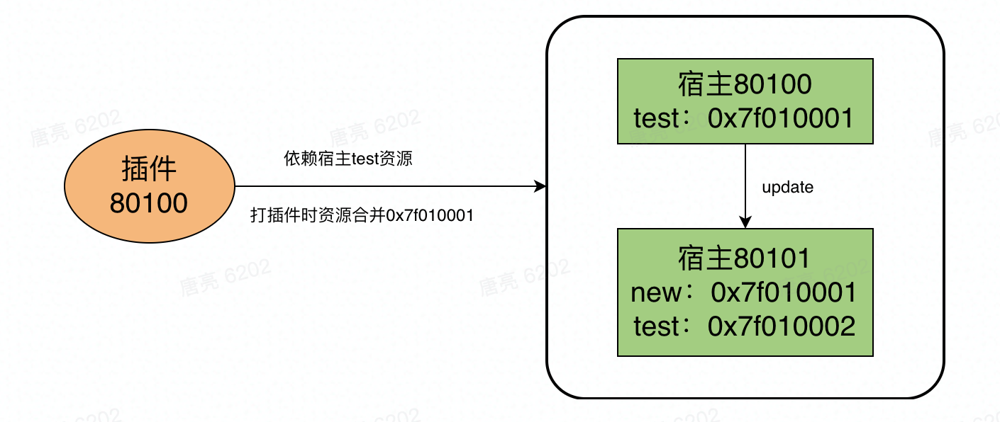

所以需要把依赖到宿主的资源写在public.xml中固定，确保每一个版本依赖的资源ID都不变。

##### 资源名称冲突

[Lite插件与宿主资源重复问题分析](http://www.autism-tl.cn/2020/12/22/%E6%8F%92%E4%BB%B6%E4%B8%8E%E5%AE%BF%E4%B8%BB%E8%B5%84%E6%BA%90%E5%90%8D%E9%87%8D%E5%A4%8D%E9%97%AE%E9%A2%98%E5%88%86%E6%9E%90/#more)