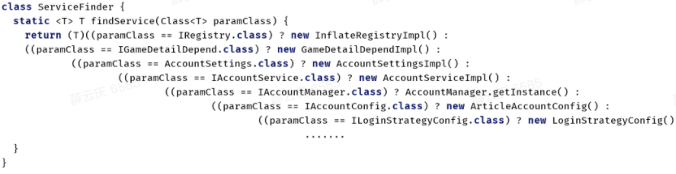

## 背景

### 组件化

**问题：**随着业务的发展扩张，业务划分粒度越来越细，多个业务团队在同一个module里面修改/维护代码的成本线性增加。合码冲突，bug率高，一个业务方改动代码，其他业务方都会受到不易被察觉的影响。开发体验极差

**期望：**理想状态是把项目按业务拆分，每个业务只需要负责自己的功能模块，不与其他业务方有耦合。

**解决方案：**业界有比较成熟的架构方案--**组件化**，把业务模块独立出来，形成一个个业务组件。类似搭积木，每个业务组件都是积木，搭建在一起拼成App工程。**独立出来的组件可以单独维护和升级而不会影响到其他的组件。**


### 组件通信

各业务模块独立成组件之后，存在编译隔离，组件之间不能直接依赖。各业务间相互调用要怎么处理呢？

- 安卓原生提供的方式类似广播、共享内存、intent等，开发与维护起来都非常麻烦
- 业界通用的解决方法：EventBus的事件通知，组件服务化等。

**事件通知**明显的缺陷是代码上下文难以关联，堆栈的切换导致断点/追踪代码比较困难

**组件服务化**是指把业务组件拆分为api+impl，api层作为与其他组件通信媒介接口，真正的实现在impl层，外界依赖api层实现组件的通信。**后文将根据此方法展开**


### **组件服务化**方案设计：

方案一：全局工具类

```
//base-model

object ServiceManager {

    val services: MutableMap<Class<*>, Any> = HashMap()

}


//IUgcService  -- ugc-api

//UgcServiceImpl  --  ugc-impl

class BaseApplication : Application() {

    override fun onCreate() {

        //手动注册服务

        ServiceManager.services.put(IUgcService::class.java, UgcServiceImpl())

        ......

    }

}
```

业务模块只需要依赖ServiceManager，传入api层对应的接口，就能获取实例了。但这种方案的缺点也很明显：

1. 实例不是懒加载，Service比较多的情况下会严重影响App启动速度
2. 模块代码对业务层(ugc-impl)存在依赖，无法解决编译隔离问题


方案二：反射

```
//base-model

object ServiceManager {

    //注册

    val servicesMap: MutableMap<Class<*>, String> = HashMap()

    //实例缓存

    private val servicesCache: MutableMap<Class<*>, Any> = HashMap()


    fun <T> getService(mClass: Class<T>): T? {

        if (!servicesMap.containsKey(mClass)) {

            Log.e("ServiceManager", "{$mClass} is not registered" )

            return null

        }

        //取缓存

        val impl = servicesCache[mClass] as? T

        //反射获取实例

        if (impl == null) {

            try {

                val implClassName = servicesMap[mClass]

                val implClass = Class.forName(implClassName!!)

                val implInstance = implClass.newInstance()

                servicesCache[mClass] = implInstance

                impl = implInstance as T?

            } catch (ignore: Throwable) {

                // ignore

            }

        }

        return impl

    }

}


//IUgcService  -- ugc-api

class BaseApplication : Application() {

    override fun onCreate() {

        //手动注册服务

        ServiceManager.servicesMap.put(IUgcService::class.java, 

        "com.bytedance.ugc.UgcServiceImpl")

        ......

    }

}
```

用反射的方法实现懒加载并且解掉了对业务层代码的依赖，但带来其他的问题：

1. 注册时需要将类名以字符串的形式写入，类名变化时要同步修改注册逻辑，风险大，维护成本高
2. 反射创建实例影响性能


**目标：**

- 简化使用和配置
- 编译隔离
- 懒加载
- 不反射


## ServiceManager

> ServiceManager的核心思想：服务化，服务化就是一切面向接口，由接口提供服务，业务模块之间不直接耦合，通过约定好的接口进行访问。 简单来讲就是接口和实现分离。通过接口定义，明确组件、模块对外提供的能力。

### 使用方式

```
//1. 新写接口继承IService

public interface IPreviewSearchDialogService extends IService {

    void showSearchDialog(Context context);

}


//2. 新写接口实现类, ServiceImpl注解作用于实现类

@ServiceImpl

class PreviewSearchDialogServiceImpl : IPreviewSearchDialogService {

    override fun showSearchDialog(context: Context)) {

        //do something

    }

}


//3. 通过ServiceManager获取实例   或直接用kotlin扩展方法getService()

ServiceManager.getService(IPreviewSearchDialogService.class)?.showSearchDialog(context)
```


### ServiceManager源码分析

ServiceManager.getService：


完成简化配置、编译隔离、懒加载、不反射等目标的关键点在ServiceFinder中，查看ServiceFinder源码


要查看ServiceFinder.findService方法中动态注入的代码，需要找到ServiceFinder类在apk中的字节码


可以看到findService方法把所有的IService -> ServiceImpl的映射保存了，并返回了ServiceImpl的实例


### 原理

工程结构清晰，整体不超过30个文件，代码大部分内容是**APT、Transform + ASM**操作


#### **APT：**

> APT(Annotation Processing Tool)：注解处理器是javac(java compiler)中处理Annotation注解的工具。是编译期间构建完AST（抽象语法树）之后进行的，通过APT我们可以对注解（自定义注解、系统注解）做相应的处理。例如读取注解的值，读取被注解标记的类的类型、泛型、父类，读取被注解标记的属性等。通常是用APT+Javapoet生成java代码类，生成的类也会参与javac的编译。


**ServiceProcessor解析：**

1. 筛选接口：ServiceProcessor遍历被@ServiceImpl标记类的所有接口，筛选出其中**直接**继承IService的接口进行下一步操作
2. 构造newInstance方法：遍历标记类中所有子元素，查找是否仅存在一个被@ServiceImplFactory注解的静态可见构造方法。如果有就返回此静态方法，否则返回默认空参数构造方法
3. 构造collectService方法：将继承IService的接口作为key，其实现类作为value，以类名字符串的形式put到一个map中
4. 构造代理类：在接口的包路径下生成名称为{接口名}_ServiceProxy的类，继承自IServiceProxy接口，并实现newInstance和collectService方法


#### **Gradle Transform**

**Gradle基础：**

> Gradle是专注于灵活性和性能的开源构建自动化工具

> **Project**和**Task**是Gradle最重要的两个概念：一个项目(Project)可以是用来构建Jar、aar、Apk，通常由一个或者多个Task组成。Task代表着构建执行中的一个原子操作，比如说编译class，生成apk等。Task之间可以通过dependsOn、mustRunAfter等方法添加依赖关系

所有的Gradle Task的执行都会经过三个阶段：

1. 初始化阶段：初始化项目环境，执行settings.gradle确定有哪些项目参与构建
2. 配置阶段：执行所有项目的build.gradle文件，创建&配置Task，梳理Task依赖形成一个有向无环图
3. 执行阶段：按照之前配置好的顺序执行Task

./gradlew assembleDebug也走了这三个阶段


**Gradle插件：**

Gradle插件是一组可复用的构建逻辑，有脚本插件[apply from:  project.file(xxx.gradle)]和对象插件[apply plugin : xxx]两种，主要用来获取项目构建中的各种信息，干预项目构建流程，增加自定义逻辑


对象插件在根build.grade文件的buildscript中通过classpath依赖


**Transform介绍**

> Gradle Transform是Android官方提供给开发者在项目构建阶段由class到dex转换期间修改class文件的一套api。目前经典的应用就是字节码插桩和代码注入技术。有了这个API，我们就可以根据自己的业务需求做一些定制。

我们可以通过Gradle插件来注册我们编写的Transform。注册后的Transform会被Gradle包装成一个Gradle Task，这个TransForm Task会在javac Task执行完毕后运行。


**ASM介绍**：ASM是一个通用的Java字节码操作和分析框架。 它可以以二进制形式修改现有类或动态生成类。


**ServiceMergeTransform解析：**

1. 拦截所有以_ServiceProxy结尾的代码类，解析出map和静态构造方法
2. 根据mira extension判断是否为插件打包
3. 插件打包：校验接口的包名是否与插件的包名/手动添加的包名一致，校验完成后直接return
4. 非插件打包：通过ASM把解析出的map和静态构造方法(无静态构造方法则用默认无参构造方法)以字节码的形式插入到ServiceFinder.findService中，Java代码类似下图




#### **在插件中如何运作？**

- 插件和宿主依赖同一个库时，插件中的依赖会自动转为compileOnly。所以插件apk中是不存在ServiceManager和ServiceFinder的，插件运行时用的是宿主中的类
- 故打插件apk会通过APT生成代理类，但不会通过Transform往ServiceFinder(插件中无此类)注入代码
- 插件中调用ServiceManager.getService执行的是最后一段代码，通过反射在APT过程中生成的代理类，调用代理类的newInstance方法返回实现类的实例


